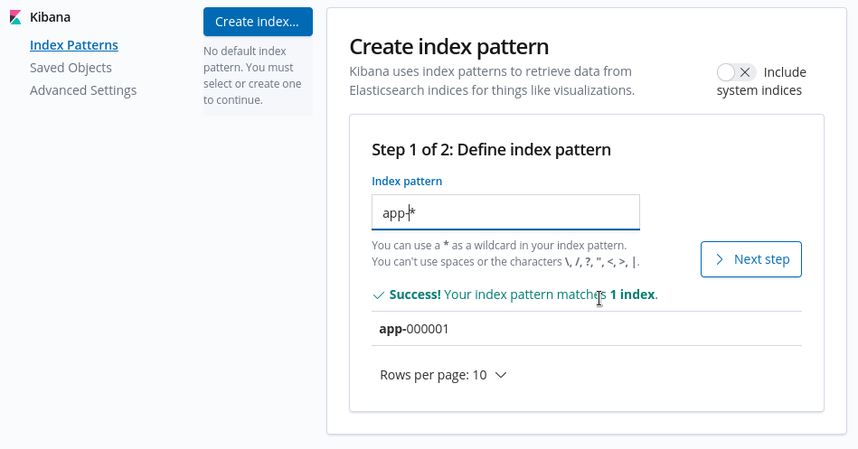
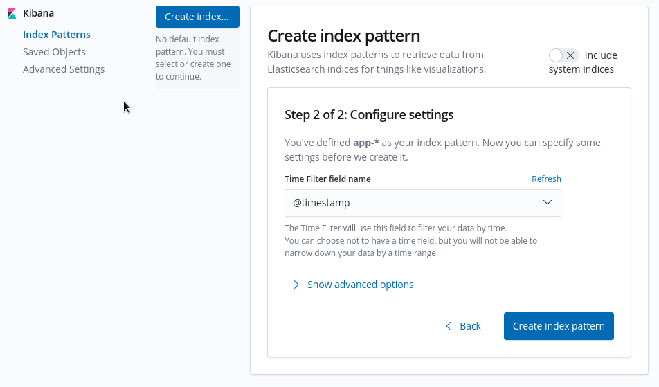

# OpenShift Logging Subsystem

## For Lokistack and Vector

- Provision an S3 bucket and specify its coordinates in `.env`

- If using minio make sure the TLS cert for the minio tenant is recognized by the Lokistack.
    - patch the clusterlogging spec:
    ```yaml
    spec:
      storage:
        tls:
          caName: tenant0-tls
    ```
    - copy minio's CA cert to the openshift-logging namespace
    ```bash
    temp_file=$(mktemp)
    oc get secret -n minio-tenant tenant0-tls -oyaml | \
        jq -r '.data."public.crt" | @base64d' > ${temp_file}
    oc create configmap tenant0-tls -n openshift-logging --from-file "service-ca.crt=${temp_file}"
    ```
- In `deploy.sh` set `logging_stack=loki`
- Enable the console plugin in the OpenShift ClusterLogging resource.

## For ELK

- In `deploy.sh` set `logging_stack=elk`
- After install you must configure indices in Kibana as documented here: <https://docs.openshift.com/container-platform/4.12/logging/cluster-logging-deploying.html#cluster-logging-visualizer-indices_cluster-logging-deploying>, illustrations follow:

    
    

## Resources

- https://docs.openshift.com/container-platform/4.12/logging/cluster-logging.html
- https://loki-operator.dev/
- https://github.com/grafana/loki/tree/main/operator
